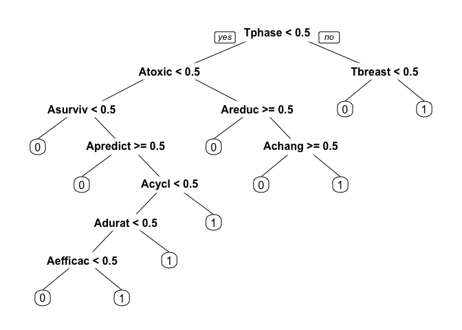

# AUTOMATING REVIEWS IN MEDICINE
Solutions by John Bobo based on a problem set from MIT’s Analytics Edge MOOC  
May 26, 2016  


The medical literature is enormous. Pubmed, a database of medical publications maintained by the U.S. National Library of Medicine, has indexed over 23 million medical publications. Further, the rate of medical publication has increased over time, and now there are nearly 1 million new publications in the field each year, or more than one per minute.

The large size and fast-changing nature of the medical literature has increased the need for reviews, which search databases like Pubmed for papers on a particular topic and then report results from the papers found. While such reviews are often performed manually, with multiple people reviewing each search result, this is tedious and time consuming. In this problem, we will see how text analytics can be used to automate the process of information retrieval.

The dataset consists of the titles (variable _title_) and abstracts (variable _abstract_) of papers retrieved in a [Pubmed](http://www.ncbi.nlm.nih.gov/pubmed) search. Each search result is labeled with whether the paper is a clinical trial testing a drug therapy for cancer (variable _trial_). These labels were obtained by two people reviewing each search result and accessing the actual paper if necessary, as part of a literature review of clinical trials testing drug therapies for advanced and metastatic breast cancer.

***

#### Problem 1.1 - Loading the Data

(1 point possible)

Load [clinical_trial.csv](https://d37djvu3ytnwxt.cloudfront.net/asset-v1:MITx+15.071x_3+1T2016+type@asset+block/clinical_trial.csv) into a data frame called trials (remembering to add the argument stringsAsFactors=FALSE).

```r
trials <- read.csv("/Users/johnbobo/analytics_edge/data/clinical_trial.csv",
                   stringsAsFactors = FALSE)
```

We can use R's string functions to learn more about the titles and abstracts of the located papers. The nchar() function counts the number of characters in a piece of text. Using the nchar() function on the variables in the data frame, answer the following questions:

*How many characters are there in the longest abstract? (Longest here is defined as the abstract with the largest number of characters.)*  

```r
answer <- max(nchar(trials$abstract))
```
**Answer:** 3708

***

#### Problem 1.2 - Loading the Data

(1 point possible)
*How many search results provided no abstract?*  

```r
answer <- sum(nchar(trials$abstract) == 0)
```
**Answer:** 112

***

#### Problem 1.3 - Loading the Data

(1 point possible)
Find the observation with the minimum number of characters in the title (the variable "title") out of all of the observations in this dataset. What is the text of the title of this article? Include capitalization and punctuation in your response, but don't include the quotes.

```r
answer <- trials$title[which.min(nchar(trials$title))]
```
**Answer:** A decade of letrozole: FACE.

***

#### Problem 2.1 - Preparing the Corpus

(4 points possible)
Because we have both title and abstract information for trials, we need to build two corpera instead of one. Name them corpusTitle and corpusAbstract.

Following the commands from lecture, perform the following tasks (you might need to load the "tm" package first if it isn't already loaded). Make sure to perform them in this order.

1) Convert the title variable to corpusTitle and the abstract variable to corpusAbstract.

2) Convert corpusTitle and corpusAbstract to lowercase. After performing this step, remember to run the lines:

`corpusTitle = tm_map(corpusTitle, PlainTextDocument)`

`corpusAbstract = tm_map(corpusAbstract, PlainTextDocument)`

3) Remove the punctuation in corpusTitle and corpusAbstract.

4) Remove the English language stop words from corpusTitle and corpusAbstract.

5) Stem the words in corpusTitle and corpusAbstract (each stemming might take a few minutes).

6) Build a document term matrix called dtmTitle from corpusTitle and dtmAbstract from corpusAbstract.

7) Limit dtmTitle and dtmAbstract to terms with sparseness of at most 95% (aka terms that appear in at least 5% of documents).

8) Convert dtmTitle and dtmAbstract to data frames (keep the names dtmTitle and dtmAbstract).


```r
library(tm)
```

```
## Loading required package: NLP
```

```r
vectorToDTM <-function(data, sparse){
    corpus = Corpus(VectorSource(data))
    corpus = tm_map(corpus, content_transformer(tolower))
    corpus = tm_map(corpus, PlainTextDocument)
    corpus = tm_map(corpus, removePunctuation)
    corpus = tm_map(corpus, removeWords, stopwords('english'))
    corpus = tm_map(corpus, stemDocument)
    
    dtm = DocumentTermMatrix(corpus)
    dtmSparse = removeSparseTerms(dtm, sparse)
    df = as.data.frame(as.matrix(dtmSparse))
    return(df)
}
dtmTitle <- vectorToDTM(trials$title, .95)
dtmAbstract <- vectorToDTM(trials$abstract, .95)
```
*How many terms remain in `dtmTitle` after removing sparse terms (aka how many columns does it have)?*  

**Answer:** 31

*How many terms remain in `dtmAbstract`?*  

**Answer:** 335

***

####  Problem 2.2 - Preparing the Corpus

(1 point possible)
*What is the most likely reason why dtmAbstract has so many more terms than dtmTitle?*  

**Answer:** Abstracts tend to have many more words than titles.

***

#### Problem 2.3 - Preparing the Corpus

(1 point possible)
*What is the most frequent word stem across all the abstracts?*

```r
sort(colSums(dtmAbstract), decreasing = TRUE)[1]
```

```
## patient 
##    8381
```
**Answer:** patient.  This shouldn't be too surprising.

***

#### Problem 3.1 - Building a model

(1 point possible)
We want to combine dtmTitle and dtmAbstract into a single data frame to make predictions. However, some of the variables in these data frames have the same names. To fix this issue, run the following commands:

```r
colnames(dtmTitle) = paste0("T", colnames(dtmTitle))
colnames(dtmAbstract) = paste0("A", colnames(dtmAbstract))
```
*What was the effect of these functions?*  

**Answer:**  Adding the letter T in front of all the title variable names and adding the letter A in front of all the abstract variable names. 

***

#### Problem 3.2 - Building a Model

(1 point possible)
Using cbind(), combine dtmTitle and dtmAbstract into a single data frame called dtm.

```r
dtm <- cbind(dtmTitle, dtmAbstract, row.names = NULL)
```
As we did in class, add the dependent variable "trial" to dtm, copying it from the original data frame called trials. 

```r
dtm$trial <- trials$trial
```

*How many columns are in this combined data frame?*  

**Answer:** 367

***

#### Problem 3.3 - Building a Model

(1 point possible)
Now that we have prepared our data frame, it's time to split it into a training and testing set and to build regression models. Set the random seed to 144 and use the sample.split function from the caTools package to split dtm into data frames named "train" and "test", putting 70% of the data in the training set.

```r
library(caTools)
set.seed(144)

spl <- sample.split(dtm$trial, SplitRatio = 0.7)
train <- subset(dtm, spl == TRUE)
test <- subset(dtm, spl == FALSE)
```

*What is the accuracy of the baseline model on the training set?*

```r
table(train$trial)
```

```
## 
##   0   1 
## 730 572
```
**Answer:** 0.561

***

#### Problem 3.4 - Building a Model

(2 points possible)
Build a CART model called trialCART, using all the independent variables in the training set to train the model, and then plot the CART model. Just use the default parameters to build the model (don't add a minbucket or cp value). Remember to add the method="class" argument, since this is a classification problem.

```r
library(rpart)
library(rpart.plot)

trialCART <- rpart(trial ~ ., data=train, method='class')
prp(trialCART)
```

<!-- -->

*What is the name of the first variable the model split on?*  

**Answer:** `Tphase`.

***

#### Problem 3.5 - Building a Model

(1 point possible)
Obtain the training set predictions for the model (do not yet predict on the test set). Extract the predicted probability of a result being a trial (recall that this involves not setting a type argument, and keeping only the second column of the predict output). 

```r
predTrain <- predict(trialCART)
pred.prob <- predTrain[,2]
```

*What is the maximum predicted probability for any result?*

```r
answer <- max(pred.prob)
```
**Answer:** 0.872

***

#### Problem 3.6 - Building a Model

(1 point possible)
Without running the analysis, *how do you expect the maximum predicted probability to differ in the testing set?*  

**Answer:**  The maximum predicted probability will likely be exactly the same in the testing set. Because the CART tree assigns the same predicted probability to each leaf node and there are a small number of leaf nodes compared to data points, we expect exactly the same maximum predicted probability.

***

#### Problem 3.7 - Building a Model

(3 points possible)
For these questions, use a threshold probability of 0.5 to predict that an observation is a clinical trial.

*What is the training set accuracy of the CART model?*

```r
table(train$trial, pred.prob >= 0.5)
```

```
##    
##     FALSE TRUE
##   0   631   99
##   1   131  441
```
**Answer:** 0.823


*What is the training set sensitivity of the CART model?*

**Answer:** 0.771 


*What is the training set specificity of the CART model?*

**Answer:** 0.864

***

#### Problem 4.1 - Evaluating the model on the testing set

(2 points possible)
Evaluate the CART model on the testing set using the predict function and creating a vector of predicted probabilities predTest.

```r
predTest.prob <- predict(trialCART, newdata=test)[,2]
```

*What is the testing set accuracy, assuming a probability threshold of 0.5 for predicting that a result is a clinical trial?*

```r
table(test$trial, predTest.prob >= 0.5)
```

```
##    
##     FALSE TRUE
##   0   261   52
##   1    83  162
```
**Answer:** 0.758

***

#### Problem 4.2 - Evaluating the Model on the Testing Set

(2 points possible)
Using the ROCR package, what is the testing set AUC of the prediction model?

```r
library(ROCR)
```

```
## Loading required package: gplots
```

```
## 
## Attaching package: 'gplots'
```

```
## The following object is masked from 'package:stats':
## 
##     lowess
```

```r
rocr_pred <- prediction(predTest.prob, test$trial)

auc <- performance(rocr_pred, "auc")@y.values
```
**Answer:** 0.837

### PART 5: DECISION-MAKER TRADEOFFS

The decision maker for this problem, a researcher performing a review of the medical literature, would use a model (like the CART one we built here) in the following workflow:

1) For all of the papers retreived in the PubMed Search, predict which papers are clinical trials using the model. This yields some initial Set A of papers predicted to be trials, and some Set B of papers predicted not to be trials. (See the figure below.)

2) Then, the decision maker manually reviews all papers in Set A, verifying that each paper meets the study's detailed inclusion criteria (for the purposes of this analysis, we assume this manual review is 100% accurate at identifying whether a paper in Set A is relevant to the study). This yields a more limited set of papers to be included in the study, which would ideally be all papers in the medical literature meeting the detailed inclusion criteria for the study.

3) Perform the study-specific analysis, using data extracted from the limited set of papers identified in step 2.

***

#### Problem 5.1 - Decision-Maker Tradeoffs

(1 point possible)
*What is the cost associated with the model in Step 1 making a false negative prediction?*  

**Answer:** A paper that should have been included in Set A will be missed, affecting the quality of the results of Step 3. 

***

#### Problem 5.2 - Decision-Maker Tradeoffs

(1 point possible)
*What is the cost associated with the model in Step 1 making a false positive prediction?*  

**Answer:**  A paper will be mistakenly added to Set A, yielding additional work in Step 2 of the process but not affecting the quality of the results of Step 3.

***

#### Problem 5.3 - Decision-Maker Tradeoffs

(1 point possible)
Given the costs associated with false positives and false negatives, which of the following is most accurate?

**Answer:**  A false negative is more costly than a false positive; the decision maker should use a probability threshold less than 0.5 for the machine learning model. A false positive just means more work, a false negative affects the legitimacy of our work.
