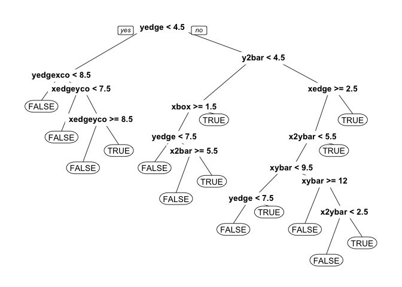

# Letter Recognition
By John Bobo based on a problem set from MIT’s Analytics Edge MOOC  
May 24, 2016  


One of the earliest applications of the predictive analytics methods we have studied so far in this class was to automatically recognize letters, which post office machines use to sort mail. In this problem, we will build a model that uses statistics of images of four letters in the Roman alphabet -- A, B, P, and R -- to predict which letter a particular image corresponds to.

Note that this is a **multiclass classification problem**. We have mostly focused on binary classification problems (e.g., predicting whether an individual voted or not, whether the Supreme Court will affirm or reverse a case, whether or not a person is at risk for a certain disease, etc.). In this problem, we have more than two classifications that are possible for each observation, like in the D2Hawkeye lecture. 

The file [letters_ABPR.csv](https://d37djvu3ytnwxt.cloudfront.net/asset-v1:MITx+15.071x_3+1T2016+type@asset+block/letters_ABPR.csv) contains 3116 observations, each of which corresponds to a certain image of one of the four letters A, B, P and R. The images came from 20 different fonts, which were then randomly distorted to produce the final images; each such distorted image is represented as a collection of pixels, each of which is "on" or "off". For each such distorted image, we have available certain statistics of the image in terms of these pixels, as well as which of the four letters the image is. This data comes from the [UCI Machine Learning Repository](http://archive.ics.uci.edu/ml/datasets/Letter+Recognition).

This dataset contains the following 17 variables:

- _letter =_ the letter that the image corresponds to (A, B, P or R)
- _xbox =_ the horizontal position of where the smallest box covering the letter shape begins.
- _ybox =_ the vertical position of where the smallest box covering the letter shape begins.
- _width =_ the width of this smallest box.
- _height =_ the height of this smallest box.
- _onpix =_ the total number of "on" pixels in the character image
- _xbar =_ the mean horizontal position of all of the "on" pixels
- _ybar =_ the mean vertical position of all of the "on" pixels
- _x2bar =_ the mean squared horizontal position of all of the "on" pixels in the image
- _y2bar =_ the mean squared vertical position of all of the "on" pixels in the image
- _xybar =_ the mean of the product of the horizontal and vertical position of all of the "on" pixels in the image
- _x2ybar =_ the mean of the product of the squared horizontal position and the vertical position of all of the "on" pixels
- _xy2bar =_ the mean of the product of the horizontal position and the squared vertical position of all of the "on" pixels
- _xedge =_ the mean number of edges (the number of times an "off" pixel is followed by an "on" pixel, or the image boundary is hit) as the image is scanned from left to right, along the whole vertical length of the image
- _xedgeycor =_ the mean of the product of the number of horizontal edges at each vertical position and the vertical position
- _yedge =_ the mean number of edges as the images is scanned from top to bottom, along the whole horizontal length of the image
- _yedgexcor =_ the mean of the product of the number of vertical edges at each horizontal position and the horizontal position

#### Problem 1.1 - Predicting B or not B

(2 points possible)

Let's warm up by attempting to predict just whether a letter is B or not. To begin, load the file [letters_ABPR.csv](https://d37djvu3ytnwxt.cloudfront.net/asset-v1:MITx+15.071x_3+1T2016+type@asset+block/letters_ABPR.csv) into R, and call it letters. Then, create a new variable isB in the dataframe, which takes the value "TRUE" if the observation corresponds to the letter B, and "FALSE" if it does not.

```r
letters <- read.csv("/Users/johnbobo/analytics_edge/data/letters_ABPR.csv")

letters$isB <- as.factor(letters$letter == "B")
```
Now split the data set into a training and testing set, putting 50% of the data in the training set. Set the seed to 1000 before making the split. The first argument to sample.split should be the dependent variable "letters$isB". Remember that TRUE values from sample.split should go in the training set.

```r
library(caTools)
set.seed(1000)

spl <- sample.split(letters$isB, SplitRatio = 0.5)
train <- subset(letters, spl == TRUE)
test <- subset(letters, spl == FALSE)
```

Before building models, let's consider a baseline method that always predicts the most frequent outcome, which is "not B". *What is the accuracy of this baseline method on the test set?*

```r
answer <- mean(test$isB == FALSE)
```
**Answer:** 0.754

***

#### Problem 1.2 - Predicting B or not B

(2 points possible)
Now build a classification tree to predict whether a letter is a B or not, using the training set to build your model. Remember to remove the variable "letter" out of the model, as this is related to what we are trying to predict! To just remove one variable, you can either write out the other variables, or remember what we did in the Billboards problem in Week 3, and use the following notation:

```r
library(rpart)
library(rpart.plot)

cartB = rpart(isB ~ . - letter, data=train, method="class")
prp(cartB)
```

<!-- -->

We are just using the default parameters in our CART model, so we don't need to add the minbucket or cp arguments at all. We also added the argument method="class" since this is a classification problem.

*What is the accuracy of the CART model on the test set? (Use type="class" when making predictions on the test set.)*

```r
pred <- predict(cartB, newdata = test, type='class')
table(test$isB, pred)
```

```
##        pred
##         FALSE TRUE
##   FALSE  1118   57
##   TRUE     43  340
```
**Answer:** 0.909

***

#### Problem 1.3 - Predicting B or Not B

(2 points possible)
Now, build a random forest model to predict whether the letter is a B or not (the isB variable) using the training set. You should use all of the other variables as independent variables, except letter (since it helped us define what we are trying to predict!). Use the default settings for ntree and nodesize (don't include these arguments at all). Right before building the model, set the seed to 1000. (NOTE: You might get a slightly different answer on this problem, even if you set the random seed. This has to do with your operating system and the implementation of the random forest algorithm.)

```r
library(randomForest)
```

```
## randomForest 4.6-12
```

```
## Type rfNews() to see new features/changes/bug fixes.
```

```r
set.seed(1000)

forestB <- randomForest(isB ~ . -letter, data=train, method='class')
predForest <- predict(forestB, newdata=test)
table(test$isB, predForest)
```

```
##        predForest
##         FALSE TRUE
##   FALSE  1165   10
##   TRUE      9  374
```

*What is the accuracy of the model on the test set?*  

**Answer:** 0.988

***
