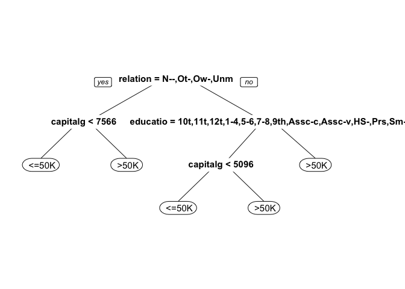
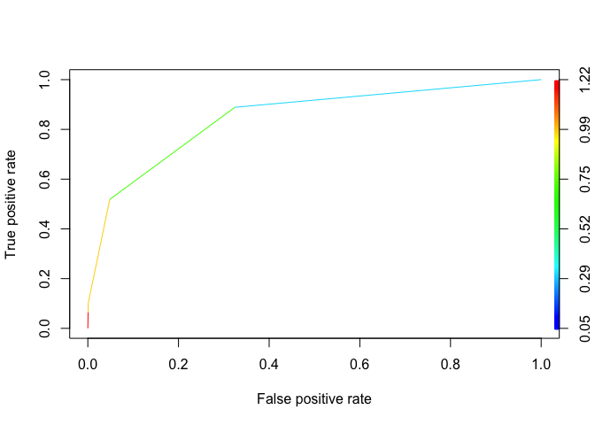

# Predicting Earnings From Census Data
By John Bobo based on a problem set from MIT’s Analytics Edge MOOC  
May 24, 2016  


The United States government periodically collects demographic information by conducting a census.

In this problem, we are going to use census information about an individual to predict how much a person earns -- in particular, whether the person earns more than $50,000 per year. This data comes from the [UCI Machine Learning Repository](http://archive.ics.uci.edu/ml/datasets/Adult).

The file [census.csv](https://d37djvu3ytnwxt.cloudfront.net/asset-v1:MITx+15.071x_3+1T2016+type@asset+block/census.csv) contains 1994 census data for 31,978 individuals in the United States.

The dataset includes the following 13 variables:

- _age =_ the age of the individual in years
- _workclass =_ the classification of the individual's working status (does the person work for the federal government, work for the local government, work without pay, and so on)
- _education =_ the level of education of the individual (e.g., 5th-6th grade, high school graduate, PhD, so on)
- _maritalstatus =_ the marital status of the individual
- _occupation =_ the type of work the individual does (e.g., administrative/clerical work, farming/fishing, sales and so on)
- _relationship =_ relationship of individual to his/her household
- _race =_ the individual's race
- _sex =_ the individual's sex
- _capitalgain =_ the capital gains of the individual in 1994 (from selling an asset such as a stock or bond for more than the original purchase price)
- _capitalloss =_ the capital losses of the individual in 1994 (from selling an asset such as a stock or bond for less than the original purchase price)
- _hoursperweek =_ the number of hours the individual works per week
- _nativecountry =_ the native country of the individual
- _over50k =_ whether or not the individual earned more than $50,000 in 1994

#### Problem 1.1 - A Logistic Regression Model

(1 point possible)

Let's begin by building a logistic regression model to predict whether an individual's earnings are above $50,000 (the variable "over50k") using all of the other variables as independent variables. First, read the dataset census.csv into R.

```r
census <- read.csv("/Users/johnbobo/analytics_edge/data/census.csv")
```

Then, split the data randomly into a training set and a testing set, setting the seed to 2000 before creating the split. Split the data so that the training set contains 60% of the observations, while the testing set contains 40% of the observations.

```r
library(caTools)
set.seed(2000)

spl <- sample.split(census$over50k, SplitRatio = 0.6)
train <- subset(census, spl == TRUE)
test <- subset(census, spl == FALSE)
```

Next, build a logistic regression model to predict the dependent variable "over50k", using all of the other variables in the dataset as independent variables. Use the training set to build the model.

```r
logReg <- glm(over50k ~ ., data=train, family='binomial')
```

```
## Warning: glm.fit: fitted probabilities numerically 0 or 1 occurred
```

*Which variables are significant, or have factors that are significant?*  

**Answer:** By looking at `summary(logReg)` you find the following are significant:  age,   workclass,   education,   maritalstatus,   occupation,   relationship,  sex,  capitalgain,   capitalloss,   and hoursperweek. 

***

#### Problem 1.2 - A Logistic Regression Model

(2 points possible)
*What is the accuracy of the model on the testing set? Use a threshold of 0.5.*

```r
predLog <- predict(logReg, newdata=test, type='response')
```

```
## Warning in predict.lm(object, newdata, se.fit, scale = 1, type =
## ifelse(type == : prediction from a rank-deficient fit may be misleading
```

```r
table(test$over50k, predLog >= 0.5)
```

```
##         
##          FALSE TRUE
##    <=50K  9051  662
##    >50K   1190 1888
```
**Answer:** 0.855

***

#### Problem 1.3 - A Logistic Regression Model

(1 point possible)
*What is the baseline accuracy for the testing set?*

```r
table(test$over50k)
```

```
## 
##  <=50K   >50K 
##   9713   3078
```
**Answer:** For our baseline we'll assume nobody makes over 50k.  That gives us an accuracy of 0.759

***

#### Problem 1.4 - A Logistic Regression Model

(2 points possible)
*What is the area-under-the-curve (AUC) for this model on the test set?*

```r
library(ROCR)
```

```
## Loading required package: gplots
```

```
## 
## Attaching package: 'gplots'
```

```
## The following object is masked from 'package:stats':
## 
##     lowess
```

```r
rocr_pred <- prediction(predLog, test$over50k)
auc <- as.numeric(performance(rocr_pred, "auc")@y.values)
```
**Answer:** 0.906

***

#### Problem 2.1 - A CART Model

(2 points possible)
We have just seen how the logistic regression model for this data achieves a high accuracy. Moreover, the significances of the variables give us a way to gauge which variables are relevant for this prediction task. However, it is not immediately clear which variables are more important than the others, especially due to the large number of factor variables in this problem.

Let us now build a classification tree to predict "over50k". Use the training set to build the model, and all of the other variables as independent variables. Use the default parameters, so don't set a value for minbucket or cp. Remember to specify method="class" as an argument to rpart, since this is a classification problem. After you are done building the model, plot the resulting tree.

```r
library(rpart)
library(rpart.plot)

tree <- rpart(over50k ~ ., data=train, method='class')
prp(tree)
```

<!-- -->

*How many splits does the tree have in total?*

**Answer:** 4.

***

#### Problem 2.2 - A CART Model

(1 point possible)
*Which variable does the tree split on at the first level (the very first split of the tree)?*  

**Answer:** `relationship`

***

#### Problem 2.3 - A CART Model

(1 point possible)
*Which variables does the tree split on at the second level (immediately after the first split of the tree)? Select all that apply.*  

**Answer:** `capitalgain` and `education`.

***

#### Problem 2.4 - A CART Model

(2 points possible)
*What is the accuracy of the model on the testing set?*

```r
predTree <- predict(tree, newdata=test, type='class')
table(test$over50k, predTree)
```

```
##         predTree
##           <=50K  >50K
##    <=50K   9243   470
##    >50K    1482  1596
```
**Answer:** 0.847

This highlights a very regular phenomenon when comparing CART and logistic regression. CART often performs a little worse than logistic regression in out-of-sample accuracy. However, as is the case here, the CART model is often much simpler to describe and understand.

***

#### Problem 2.5 - A CART Model

(1 point possible)
Let us now consider the ROC curve and AUC for the CART model on the test set. You will need to get predicted probabilities for the observations in the test set to build the ROC curve and compute the AUC. Remember that you can do this by removing the type="class" argument when making predictions, and taking the second column of the resulting object.

Plot the ROC curve for the CART model you have estimated. Observe that compared to the logistic regression ROC curve, the CART ROC curve is less smooth than the logistic regression ROC curve. Which of the following explanations for this behavior is most correct? 

```r
predTree <- predict(tree, newdata=test)
rocr_pred <- prediction(predTree[,2], test$over50k)
rocr_perf <- performance(rocr_pred, "tpr", "fpr")
```

Plot the ROC curve for the CART model you have estimated. Observe that compared to the logistic regression ROC curve, the CART ROC curve is less smooth than the logistic regression ROC curve. *Which of the following explanations for this behavior is most correct?*

```r
plot(rocr_perf, colorize = TRUE)
```

<!-- -->

**Answer:**  The probabilities from the CART model take only a handful of values (five, one for each end bucket/leaf of the tree); the changes in the ROC curve correspond to setting the threshold to one of those values. 

***

#### Problem 2.6 - A CART Model

(2 points possible)
*What is the AUC of the CART model on the test set?*

```r
auc <- as.numeric(performance(rocr_pred, "auc")@y.values)
```
**Answer:** 0.847

***

####
