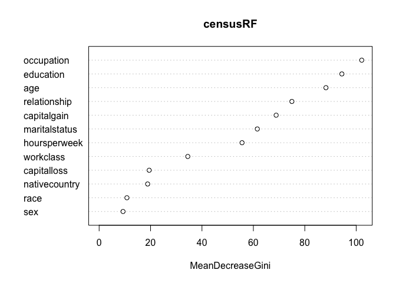

# Predicting Earnings From Census Data
By John Bobo based on a problem set from MIT’s Analytics Edge MOOC  
May 24, 2016  


The United States government periodically collects demographic information by conducting a census.

In this problem, we are going to use census information about an individual to predict how much a person earns -- in particular, whether the person earns more than $50,000 per year. This data comes from the [UCI Machine Learning Repository](http://archive.ics.uci.edu/ml/datasets/Adult).

The file [census.csv](https://d37djvu3ytnwxt.cloudfront.net/asset-v1:MITx+15.071x_3+1T2016+type@asset+block/census.csv) contains 1994 census data for 31,978 individuals in the United States.

The dataset includes the following 13 variables:

- _age =_ the age of the individual in years
- _workclass =_ the classification of the individual's working status (does the person work for the federal government, work for the local government, work without pay, and so on)
- _education =_ the level of education of the individual (e.g., 5th-6th grade, high school graduate, PhD, so on)
- _maritalstatus =_ the marital status of the individual
- _occupation =_ the type of work the individual does (e.g., administrative/clerical work, farming/fishing, sales and so on)
- _relationship =_ relationship of individual to his/her household
- _race =_ the individual's race
- _sex =_ the individual's sex
- _capitalgain =_ the capital gains of the individual in 1994 (from selling an asset such as a stock or bond for more than the original purchase price)
- _capitalloss =_ the capital losses of the individual in 1994 (from selling an asset such as a stock or bond for less than the original purchase price)
- _hoursperweek =_ the number of hours the individual works per week
- _nativecountry =_ the native country of the individual
- _over50k =_ whether or not the individual earned more than $50,000 in 1994

#### Problem 1.1 - A Logistic Regression Model

(1 point possible)

Let's begin by building a logistic regression model to predict whether an individual's earnings are above $50,000 (the variable "over50k") using all of the other variables as independent variables. First, read the dataset census.csv into R.

```r
census <- read.csv("/Users/johnbobo/analytics_edge/data/census.csv")
```

Then, split the data randomly into a training set and a testing set, setting the seed to 2000 before creating the split. Split the data so that the training set contains 60% of the observations, while the testing set contains 40% of the observations.

```r
library(caTools)
set.seed(2000)

spl <- sample.split(census$over50k, SplitRatio = 0.6)
train <- subset(census, spl == TRUE)
test <- subset(census, spl == FALSE)
```

Next, build a logistic regression model to predict the dependent variable "over50k", using all of the other variables in the dataset as independent variables. Use the training set to build the model.

```r
logReg <- glm(over50k ~ ., data=train, family='binomial')
```

```
## Warning: glm.fit: fitted probabilities numerically 0 or 1 occurred
```

*Which variables are significant, or have factors that are significant?*  

**Answer:** By looking at `summary(logReg)` you find the following are significant:  age,   workclass,   education,   maritalstatus,   occupation,   relationship,  sex,  capitalgain,   capitalloss,   and hoursperweek. 

***

#### Problem 1.2 - A Logistic Regression Model

(2 points possible)
*What is the accuracy of the model on the testing set? Use a threshold of 0.5.*

```r
predLog <- predict(logReg, newdata=test, type='response')
```

```
## Warning in predict.lm(object, newdata, se.fit, scale = 1, type =
## ifelse(type == : prediction from a rank-deficient fit may be misleading
```

```r
table(test$over50k, predLog >= 0.5)
```

```
##         
##          FALSE TRUE
##    <=50K  9051  662
##    >50K   1190 1888
```
**Answer:** 0.855

***

#### Problem 1.3 - A Logistic Regression Model

(1 point possible)
*What is the baseline accuracy for the testing set?*

```r
table(test$over50k)
```

```
## 
##  <=50K   >50K 
##   9713   3078
```
**Answer:** For our baseline we'll assume nobody makes over 50k.  That gives us an accuracy of 0.759

***

#### Problem 1.4 - A Logistic Regression Model

(2 points possible)
*What is the area-under-the-curve (AUC) for this model on the test set?*

```r
library(ROCR)
```

```
## Loading required package: gplots
```

```
## 
## Attaching package: 'gplots'
```

```
## The following object is masked from 'package:stats':
## 
##     lowess
```

```r
rocr_pred <- prediction(predLog, test$over50k)
auc <- as.numeric(performance(rocr_pred, "auc")@y.values)
```
**Answer:** 0.906

***

#### Problem 2.1 - A CART Model

(2 points possible)
We have just seen how the logistic regression model for this data achieves a high accuracy. Moreover, the significances of the variables give us a way to gauge which variables are relevant for this prediction task. However, it is not immediately clear which variables are more important than the others, especially due to the large number of factor variables in this problem.

Let us now build a classification tree to predict "over50k". Use the training set to build the model, and all of the other variables as independent variables. Use the default parameters, so don't set a value for minbucket or cp. Remember to specify method="class" as an argument to rpart, since this is a classification problem. After you are done building the model, plot the resulting tree.

```r
library(rpart)
library(rpart.plot)

tree <- rpart(over50k ~ ., data=train, method='class')
prp(tree)
```

<!-- -->

*How many splits does the tree have in total?*

**Answer:** 4.

***

#### Problem 2.2 - A CART Model

(1 point possible)
*Which variable does the tree split on at the first level (the very first split of the tree)?*  

**Answer:** `relationship`

***

#### Problem 2.3 - A CART Model

(1 point possible)
*Which variables does the tree split on at the second level (immediately after the first split of the tree)? Select all that apply.*  

**Answer:** `capitalgain` and `education`.

***

#### Problem 2.4 - A CART Model

(2 points possible)
*What is the accuracy of the model on the testing set?*

```r
predTree <- predict(tree, newdata=test, type='class')
table(test$over50k, predTree)
```

```
##         predTree
##           <=50K  >50K
##    <=50K   9243   470
##    >50K    1482  1596
```
**Answer:** 0.847

This highlights a very regular phenomenon when comparing CART and logistic regression. CART often performs a little worse than logistic regression in out-of-sample accuracy. However, as is the case here, the CART model is often much simpler to describe and understand.

***

#### Problem 2.5 - A CART Model

(1 point possible)
Let us now consider the ROC curve and AUC for the CART model on the test set. You will need to get predicted probabilities for the observations in the test set to build the ROC curve and compute the AUC. Remember that you can do this by removing the type="class" argument when making predictions, and taking the second column of the resulting object.

Plot the ROC curve for the CART model you have estimated. Observe that compared to the logistic regression ROC curve, the CART ROC curve is less smooth than the logistic regression ROC curve. Which of the following explanations for this behavior is most correct? 

```r
predTree <- predict(tree, newdata=test)
rocr_pred <- prediction(predTree[,2], test$over50k)
rocr_perf <- performance(rocr_pred, "tpr", "fpr")
```

Plot the ROC curve for the CART model you have estimated. Observe that compared to the logistic regression ROC curve, the CART ROC curve is less smooth than the logistic regression ROC curve. *Which of the following explanations for this behavior is most correct?*

```r
plot(rocr_perf, colorize = TRUE)
```

<!-- -->

**Answer:**  The probabilities from the CART model take only a handful of values (five, one for each end bucket/leaf of the tree); the changes in the ROC curve correspond to setting the threshold to one of those values. 

***

#### Problem 2.6 - A CART Model

(2 points possible)
*What is the AUC of the CART model on the test set?*

```r
auc <- as.numeric(performance(rocr_pred, "auc")@y.values)
```
**Answer:** 0.847

***

#### Problem 3.1 - A Random Forest Model

(2 points possible)
Before building a random forest model, we'll down-sample our training set. While some modern personal computers can build a random forest model on the entire training set, others might run out of memory when trying to train the model since random forests is much more computationally intensive than CART or Logistic Regression. For this reason, before continuing we will define a new training set to be used when building our random forest model, that contains 2000 randomly selected obervations from the original training set. Do this by running the following commands in your R console (assuming your training set is called "train"):

```r
set.seed(1)

trainSmall <- train[sample(nrow(train), 2000), ]
```
Let us now build a random forest model to predict "over50k", using the dataset "trainSmall" as the data used to build the model. Set the seed to 1 again right before building the model, and use all of the other variables in the dataset as independent variables.

```r
library(randomForest)
```

```
## randomForest 4.6-12
```

```
## Type rfNews() to see new features/changes/bug fixes.
```

```r
set.seed(1)
censusRF <- randomForest(over50k ~ ., data=trainSmall)
```
Then, make predictions using this model on the entire test set. *What is the accuracy of the model on the test set?* 

```r
forestPred <- predict(censusRF, newdata=test)
table(test$over50k, forestPred)
```

```
##         forestPred
##           <=50K  >50K
##    <=50K   9586   127
##    >50K    1985  1093
```
**Answer:** 0.835

***

#### Problem 3.2 - A Random Forest Model

(1 point possible)
As we discussed in lecture, random forest models work by building a large collection of trees. As a result, we lose some of the interpretability that comes with CART in terms of seeing how predictions are made and which variables are important. However, we can still compute metrics that give us insight into which variables are important.

One metric that we can look at is the number of times, aggregated over all of the trees in the random forest model, that a certain variable is selected for a split. To view this metric, run the following lines of R code:

```r
vu <- varUsed(censusRF, count=TRUE)

vusorted <- sort(vu, decreasing = FALSE, index.return = TRUE)

dotchart(vusorted$x, names(censusRF$forest$xlevels[vusorted$ix]))
```

<!-- -->
This code produces a chart that for each variable measures the number of times that variable was selected for splitting (the value on the x-axis). *Which variable is the most important in terms of the number of splits?*  

**Answer:** `age`.

***

#### Problem 3.3 - A Random Forest Model

(1 point possible)
A different metric we can look at is related to "impurity", which measures how homogenous each bucket or leaf of the tree is. In each tree in the forest, whenever we select a variable and perform a split, the impurity is decreased. Therefore, one way to measure the importance of a variable is to average the reduction in impurity, taken over all the times that variable is selected for splitting in all of the trees in the forest. 

```r
varImpPlot(censusRF)
```

<!-- -->
*Which of the variables is the most important in terms of mean reduction in impurity?*  

**Answer:** `occupation`.

***

#### Problem 4.1 - Selecting cp by Cross-Validation

(1 point possible)
We now conclude our study of this data set by looking at how CART behaves with different choices of its parameters.

Let us select the cp parameter for our CART model using k-fold cross validation, with k = 10 folds. Do this by using the train function. Set the seed beforehand to 2. Test cp values from 0.002 to 0.1 in 0.002 increments, by using the following command:

```r
library(caret)
```

```
## Loading required package: lattice
```

```
## Loading required package: ggplot2
```

```
## 
## Attaching package: 'ggplot2'
```

```
## The following object is masked from 'package:randomForest':
## 
##     margin
```

```r
set.seed(2)

numFolds <- trainControl( method = "cv", number = 10)
cartGrid <- expand.grid( .cp = seq(0.002,0.1,0.002))
```
Also, remember to use the entire training set "train" when building this model. The train function might take some time to run.

```r
train(over50k ~ ., data=train, method='rpart', 
                    trControl=numFolds, tuneGrid=cartGrid)
```

```
## CART 
## 
## 19187 samples
##    12 predictor
##     2 classes: ' <=50K', ' >50K' 
## 
## No pre-processing
## Resampling: Cross-Validated (10 fold) 
## Summary of sample sizes: 17268, 17269, 17268, 17268, 17269, 17269, ... 
## Resampling results across tuning parameters:
## 
##   cp     Accuracy  Kappa 
##   0.002  0.852     0.5576
##   0.004  0.848     0.5535
##   0.006  0.844     0.5339
##   0.008  0.844     0.5344
##   0.010  0.844     0.5357
##   0.012  0.844     0.5357
##   0.014  0.844     0.5357
##   0.016  0.843     0.5312
##   0.018  0.841     0.5140
##   0.020  0.840     0.5061
##   0.022  0.839     0.5018
##   0.024  0.839     0.5018
##   0.026  0.839     0.5018
##   0.028  0.839     0.5018
##   0.030  0.839     0.5018
##   0.032  0.839     0.5018
##   0.034  0.837     0.4888
##   0.036  0.832     0.4636
##   0.038  0.827     0.4386
##   0.040  0.825     0.4302
##   0.042  0.825     0.4302
##   0.044  0.825     0.4302
##   0.046  0.822     0.4130
##   0.048  0.822     0.4130
##   0.050  0.822     0.4130
##   0.052  0.815     0.3563
##   0.054  0.813     0.3256
##   0.056  0.812     0.3079
##   0.058  0.812     0.3079
##   0.060  0.812     0.3079
##   0.062  0.812     0.3079
##   0.064  0.810     0.2954
##   0.066  0.810     0.2954
##   0.068  0.801     0.2462
##   0.070  0.796     0.2147
##   0.072  0.796     0.2147
##   0.074  0.796     0.2147
##   0.076  0.773     0.0786
##   0.078  0.759     0.0000
##   0.080  0.759     0.0000
##   0.082  0.759     0.0000
##   0.084  0.759     0.0000
##   0.086  0.759     0.0000
##   0.088  0.759     0.0000
##   0.090  0.759     0.0000
##   0.092  0.759     0.0000
##   0.094  0.759     0.0000
##   0.096  0.759     0.0000
##   0.098  0.759     0.0000
##   0.100  0.759     0.0000
## 
## Accuracy was used to select the optimal model using  the largest value.
## The final value used for the model was cp = 0.002.
```

*Which value of cp does the train function recommend?*  

**Answer:** cp = 0.002

***

#### Problem 4.2 - Selecting cp by Cross-Validation

(2 points possible)
Fit a CART model to the training data using this value of cp. *What is the prediction accuracy on the test set?*

```r
tree <- rpart(over50k ~ ., data=train, method='class', cp=0.002)

predTest <- predict(tree, newdata=test, type='class')
table(test$over50k, predTest)
```

```
##         predTest
##           <=50K  >50K
##    <=50K   9178   535
##    >50K    1240  1838
```
**Answer:** 0.861

***

#### Problem 4.3 - Selecting cp by Cross-Validation

(1 point possible)
Compared to the original accuracy using the default value of cp, this new CART model is an improvement, and so we should clearly favor this new model over the old one -- or should we? Plot the CART tree for this model. *How many splits are there?*

```r
prp(tree)
```

<!-- -->

**Answer:** 18.

This highlights one important tradeoff in building predictive models. By tuning cp, we improved our accuracy by over 1%, but our tree became significantly more complicated. In some applications, such an improvement in accuracy would be worth the loss in interpretability. In others, we may prefer a less accurate model that is simpler to understand and describe over a more accurate -- but more complicated -- model.
