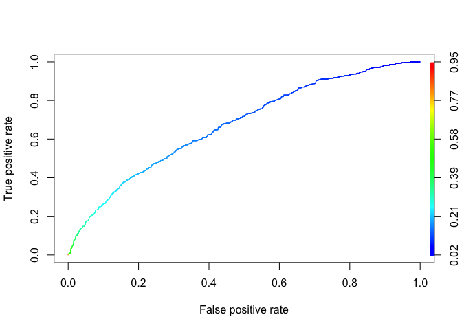
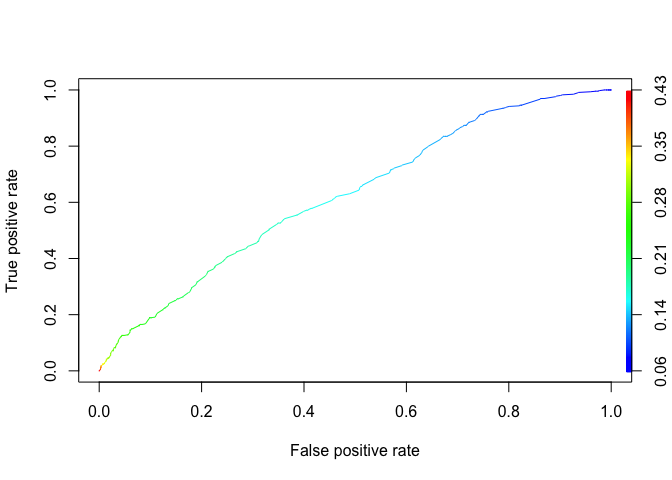

# Predicting Loan Repayment
By John Bobo based on a problem set from MIT’s Analytics Edge MOOC  
May 15, 2016  


In the lending industry, investors provide loans to borrowers in exchange for the promise of repayment with interest. If the borrower repays the loan, then the lender profits from the interest. However, if the borrower is unable to repay the loan, then the lender loses money. Therefore, lenders face the problem of predicting the risk of a borrower being unable to repay a loan.

To address this problem, we will use publicly available data from [LendingClub.com](https://www.lendingclub.com/info/download-data.action), a website that connects borrowers and investors over the Internet. This dataset represents 9,578 3-year loans that were funded through the LendingClub.com platform between May 2007 and February 2010. The binary dependent variable**not_fully_paid** indicates that the loan was not paid back in full (the borrower either defaulted or the loan was "charged off," meaning the borrower was deemed unlikely to ever pay it back).

To predict this dependent variable, we will use the following independent variables available to the investor when deciding whether to fund a loan:

- **credit.policy**: 1 if the customer meets the credit underwriting criteria of LendingClub.com, and 0 otherwise.
- **purpose**: The purpose of the loan (takes values "credit_card", "debt_consolidation", "educational", "major_purchase", "small_business", and "all_other").
- **int.rate**: The interest rate of the loan, as a proportion (a rate of 11% would be stored as 0.11). Borrowers judged by LendingClub.com to be more risky are assigned higher interest rates.
- **installment**: The monthly installments ($) owed by the borrower if the loan is funded.
- **log.annual.inc**: The natural log of the self-reported annual income of the borrower.
- **dti**: The debt-to-income ratio of the borrower (amount of debt divided by annual income).
- **fico**: The FICO credit score of the borrower.
- **days.with.cr.line**: The number of days the borrower has had a credit line.
- **revol.bal**: The borrower's revolving balance (amount unpaid at the end of the credit card billing cycle).
- **revol.util**: The borrower's revolving line utilization rate (the amount of the credit line used relative to total credit available).
- **inq.last.6mths**: The borrower's number of inquiries by creditors in the last 6 months.
- **delinq.2yrs**: The number of times the borrower had been 30+ days past due on a payment in the past 2 years.
- **pub.rec**: The borrower's number of derogatory public records (bankruptcy filings, tax liens, or judgments).

***

#### Problem 1.1 - Preparing the Dataset

(1 point possible)
Load the dataset loans.csv into a data frame called loans, and explore it using the str() and summary() functions.

```r
loans <- read.csv("/Users/johnbobo/analytics_edge/data/loans.csv")
str(loans)
```

```
## 'data.frame':	9578 obs. of  14 variables:
##  $ credit.policy    : int  1 1 1 1 1 1 1 1 1 1 ...
##  $ purpose          : Factor w/ 7 levels "all_other","credit_card",..: 3 2 3 3 2 2 3 1 5 3 ...
##  $ int.rate         : num  0.119 0.107 0.136 0.101 0.143 ...
##  $ installment      : num  829 228 367 162 103 ...
##  $ log.annual.inc   : num  11.4 11.1 10.4 11.4 11.3 ...
##  $ dti              : num  19.5 14.3 11.6 8.1 15 ...
##  $ fico             : int  737 707 682 712 667 727 667 722 682 707 ...
##  $ days.with.cr.line: num  5640 2760 4710 2700 4066 ...
##  $ revol.bal        : int  28854 33623 3511 33667 4740 50807 3839 24220 69909 5630 ...
##  $ revol.util       : num  52.1 76.7 25.6 73.2 39.5 51 76.8 68.6 51.1 23 ...
##  $ inq.last.6mths   : int  0 0 1 1 0 0 0 0 1 1 ...
##  $ delinq.2yrs      : int  0 0 0 0 1 0 0 0 0 0 ...
##  $ pub.rec          : int  0 0 0 0 0 0 1 0 0 0 ...
##  $ not.fully.paid   : int  0 0 0 0 0 0 1 1 0 0 ...
```

```r
summary(loans)
```

```
##  credit.policy                 purpose        int.rate      installment 
##  Min.   :0.000   all_other         :2331   Min.   :0.060   Min.   : 16  
##  1st Qu.:1.000   credit_card       :1262   1st Qu.:0.104   1st Qu.:164  
##  Median :1.000   debt_consolidation:3957   Median :0.122   Median :269  
##  Mean   :0.805   educational       : 343   Mean   :0.123   Mean   :319  
##  3rd Qu.:1.000   home_improvement  : 629   3rd Qu.:0.141   3rd Qu.:433  
##  Max.   :1.000   major_purchase    : 437   Max.   :0.216   Max.   :940  
##                  small_business    : 619                                
##  log.annual.inc       dti             fico     days.with.cr.line
##  Min.   : 7.55   Min.   : 0.00   Min.   :612   Min.   :  179    
##  1st Qu.:10.56   1st Qu.: 7.21   1st Qu.:682   1st Qu.: 2820    
##  Median :10.93   Median :12.66   Median :707   Median : 4140    
##  Mean   :10.93   Mean   :12.61   Mean   :711   Mean   : 4562    
##  3rd Qu.:11.29   3rd Qu.:17.95   3rd Qu.:737   3rd Qu.: 5730    
##  Max.   :14.53   Max.   :29.96   Max.   :827   Max.   :17640    
##  NA's   :4                                     NA's   :29       
##    revol.bal         revol.util    inq.last.6mths  delinq.2yrs   
##  Min.   :      0   Min.   :  0.0   Min.   : 0.0   Min.   : 0.00  
##  1st Qu.:   3187   1st Qu.: 22.7   1st Qu.: 0.0   1st Qu.: 0.00  
##  Median :   8596   Median : 46.4   Median : 1.0   Median : 0.00  
##  Mean   :  16914   Mean   : 46.9   Mean   : 1.6   Mean   : 0.16  
##  3rd Qu.:  18250   3rd Qu.: 71.0   3rd Qu.: 2.0   3rd Qu.: 0.00  
##  Max.   :1207359   Max.   :119.0   Max.   :33.0   Max.   :13.00  
##                    NA's   :62      NA's   :29     NA's   :29     
##     pub.rec     not.fully.paid
##  Min.   :0.00   Min.   :0.00  
##  1st Qu.:0.00   1st Qu.:0.00  
##  Median :0.00   Median :0.00  
##  Mean   :0.06   Mean   :0.16  
##  3rd Qu.:0.00   3rd Qu.:0.00  
##  Max.   :5.00   Max.   :1.00  
##  NA's   :29
```

What proportion of the loans in the dataset were not paid in full? Please input a number between 0 and 1.  
**Answer:** 0.16

***

#### Problem 1.2 - Preparing the Dataset

(1 point possible)
Which of the variables has at least one missing observation?  
**Answer:** `log.annual.inc`, `days.with.cr.line`, `revol.util`, `inq.last.6mnths`, `delinq.2yrs` and `pub.rec`

***

#### Problem 1.3 - Preparing the Dataset

(1 point possible)
Which is a reason to fill in the missing values for these variables instead of removing observations with missing data?

**Answer:** We want to be able to predict risk for all borrowers, instead of just the ones with all data reported. 

***

#### Problem 1.4 - Preparing the Dataset

(1 point possible)
For the rest of this problem, we'll be using a revised version of the dataset that has the missing values filled in with multiple imputation. You can download and load into R the dataset we created after running the imputation: [loans_imputed.csv](https://d37djvu3ytnwxt.cloudfront.net/asset-v1:MITx+15.071x_3+1T2016+type@asset+block/loans_imputed.csv).

```r
library(mice)
set.seed(144)

vars.for.imputation <- setdiff(names(loans), "not.fully.paid")

imputed <- complete(mice(loans[vars.for.imputation]))
```

```
## 
##  iter imp variable
##   1   1  log.annual.inc  days.with.cr.line  revol.util  inq.last.6mths  delinq.2yrs  pub.rec
##   1   2  log.annual.inc  days.with.cr.line  revol.util  inq.last.6mths  delinq.2yrs  pub.rec
##   1   3  log.annual.inc  days.with.cr.line  revol.util  inq.last.6mths  delinq.2yrs  pub.rec
##   1   4  log.annual.inc  days.with.cr.line  revol.util  inq.last.6mths  delinq.2yrs  pub.rec
##   1   5  log.annual.inc  days.with.cr.line  revol.util  inq.last.6mths  delinq.2yrs  pub.rec
##   2   1  log.annual.inc  days.with.cr.line  revol.util  inq.last.6mths  delinq.2yrs  pub.rec
##   2   2  log.annual.inc  days.with.cr.line  revol.util  inq.last.6mths  delinq.2yrs  pub.rec
##   2   3  log.annual.inc  days.with.cr.line  revol.util  inq.last.6mths  delinq.2yrs  pub.rec
##   2   4  log.annual.inc  days.with.cr.line  revol.util  inq.last.6mths  delinq.2yrs  pub.rec
##   2   5  log.annual.inc  days.with.cr.line  revol.util  inq.last.6mths  delinq.2yrs  pub.rec
##   3   1  log.annual.inc  days.with.cr.line  revol.util  inq.last.6mths  delinq.2yrs  pub.rec
##   3   2  log.annual.inc  days.with.cr.line  revol.util  inq.last.6mths  delinq.2yrs  pub.rec
##   3   3  log.annual.inc  days.with.cr.line  revol.util  inq.last.6mths  delinq.2yrs  pub.rec
##   3   4  log.annual.inc  days.with.cr.line  revol.util  inq.last.6mths  delinq.2yrs  pub.rec
##   3   5  log.annual.inc  days.with.cr.line  revol.util  inq.last.6mths  delinq.2yrs  pub.rec
##   4   1  log.annual.inc  days.with.cr.line  revol.util  inq.last.6mths  delinq.2yrs  pub.rec
##   4   2  log.annual.inc  days.with.cr.line  revol.util  inq.last.6mths  delinq.2yrs  pub.rec
##   4   3  log.annual.inc  days.with.cr.line  revol.util  inq.last.6mths  delinq.2yrs  pub.rec
##   4   4  log.annual.inc  days.with.cr.line  revol.util  inq.last.6mths  delinq.2yrs  pub.rec
##   4   5  log.annual.inc  days.with.cr.line  revol.util  inq.last.6mths  delinq.2yrs  pub.rec
##   5   1  log.annual.inc  days.with.cr.line  revol.util  inq.last.6mths  delinq.2yrs  pub.rec
##   5   2  log.annual.inc  days.with.cr.line  revol.util  inq.last.6mths  delinq.2yrs  pub.rec
##   5   3  log.annual.inc  days.with.cr.line  revol.util  inq.last.6mths  delinq.2yrs  pub.rec
##   5   4  log.annual.inc  days.with.cr.line  revol.util  inq.last.6mths  delinq.2yrs  pub.rec
##   5   5  log.annual.inc  days.with.cr.line  revol.util  inq.last.6mths  delinq.2yrs  pub.rec
```

```r
loans[vars.for.imputation] <- imputed

loans <- read.csv("/Users/johnbobo/analytics_edge/data/loans_imputed.csv")
```
Note that to do this imputation, we set vars.for.imputation to all variables in the data frame except for not.fully.paid, to impute the values using all of the other independent variables.

What best describes the process we just used to handle missing values?  
**Answer:** We predicted missing variable values using the available independent variables for each observation.

***

#### Problem 2.1 - Prediction Models

(1 point possible)
Now that we have prepared the dataset, we need to split it into a training and testing set. To ensure everybody obtains the same split, set the random seed to 144 (even though you already did so earlier in the problem) and use the sample.split function to select the 70% of observations for the training set (the dependent variable for sample.split is not.fully.paid). Name the data frames train and test.

```r
set.seed(144)
library(caTools)

split <- sample.split(loans$not.fully.paid, SplitRatio = 0.7)

train <- subset(loans, split == TRUE)
test <- subset(loans, split == FALSE)
```

Now, use logistic regression trained on the training set to predict the dependent variable not.fully.paid using all the independent variables.

```r
log_reg <- glm(not.fully.paid ~ ., data = train, family = binomial)
summary(log_reg)
```

```
## 
## Call:
## glm(formula = not.fully.paid ~ ., family = binomial, data = train)
## 
## Deviance Residuals: 
##    Min      1Q  Median      3Q     Max  
## -2.205  -0.621  -0.495  -0.361   2.640  
## 
## Coefficients:
##                            Estimate Std. Error z value Pr(>|z|)    
## (Intercept)                9.19e+00   1.55e+00    5.91  3.4e-09 ***
## credit.policy             -3.37e-01   1.01e-01   -3.33  0.00086 ***
## purposecredit_card        -6.14e-01   1.34e-01   -4.57  4.9e-06 ***
## purposedebt_consolidation -3.21e-01   9.18e-02   -3.50  0.00047 ***
## purposeeducational         1.35e-01   1.75e-01    0.77  0.44220    
## purposehome_improvement    1.73e-01   1.48e-01    1.17  0.24313    
## purposemajor_purchase     -4.83e-01   2.01e-01   -2.40  0.01620 *  
## purposesmall_business      4.12e-01   1.42e-01    2.90  0.00368 ** 
## int.rate                   6.11e-01   2.08e+00    0.29  0.76945    
## installment                1.27e-03   2.09e-04    6.09  1.1e-09 ***
## log.annual.inc            -4.34e-01   7.15e-02   -6.07  1.3e-09 ***
## dti                        4.64e-03   5.50e-03    0.84  0.39929    
## fico                      -9.32e-03   1.71e-03   -5.45  5.1e-08 ***
## days.with.cr.line          2.37e-06   1.59e-05    0.15  0.88134    
## revol.bal                  3.09e-06   1.17e-06    2.64  0.00827 ** 
## revol.util                 1.84e-03   1.53e-03    1.20  0.23072    
## inq.last.6mths             8.44e-02   1.60e-02    5.27  1.3e-07 ***
## delinq.2yrs               -8.32e-02   6.56e-02   -1.27  0.20476    
## pub.rec                    3.30e-01   1.14e-01    2.90  0.00376 ** 
## ---
## Signif. codes:  0 '***' 0.001 '**' 0.01 '*' 0.05 '.' 0.1 ' ' 1
## 
## (Dispersion parameter for binomial family taken to be 1)
## 
##     Null deviance: 5896.6  on 6704  degrees of freedom
## Residual deviance: 5485.2  on 6686  degrees of freedom
## AIC: 5523
## 
## Number of Fisher Scoring iterations: 5
```
Which independent variables are significant in our model? (Significant variables have at least one star, or a Pr(>|z|) value less than 0.05.) 

```r
names(summary(log_reg)$coef[summary(log_reg)$coef[,4] <= .05, 4][-1])
```

```
##  [1] "credit.policy"             "purposecredit_card"       
##  [3] "purposedebt_consolidation" "purposemajor_purchase"    
##  [5] "purposesmall_business"     "installment"              
##  [7] "log.annual.inc"            "fico"                     
##  [9] "revol.bal"                 "inq.last.6mths"           
## [11] "pub.rec"
```

**Answer:** `credit.policy`, `purposecredit_card`, `purposedebt_consolidation`, `purposemajor_purchase`, `purposesmall_business`, `installment`, `log.annual.inc`, `fico`, `revol.bal`, `inq.last.6mths`, and `pub.rec`.

***

#### Problem 2.2 - Prediction Models

(4 points possible)
Consider two loan applications, which are identical other than the fact that the borrower in Application A has FICO credit score 700 while the borrower in Application B has FICO credit score 710.

Let $\text{Logit}(A)$ be the log odds of loan A not being paid back in full, according to our logistic regression model, and define $\text{Logit}(B)$ similarly for loan B. What is the value of $\text{Logit}(A)-\text{Logit}(B)$?

**Answer:**  0.093

Now, let O(A) be the odds of loan A not being paid back in full, according to our logistic regression model, and define O(B) similarly for loan B. What is the value of O(A)/O(B)? (HINT: Use the mathematical rule that exp(A + B + C) = exp(A)*exp(B)*exp(C). Also, remember that exp() is the exponential function in R.)

**Answer:** 1.098 This is just $e^{\text{Logit}(A)-\text{Logit}(B)}$.

***

#### Problem 2.3 - Prediction Models

(4 points possible)
Predict the probability of the test set loans not being paid back in full (remember type="response" for the predict function). Store these predicted probabilities in a variable named predicted.risk and add it to your test set (we will use this variable in later parts of the problem). Compute the confusion matrix using a threshold of 0.5.

```r
predicted.risk <- predict(log_reg, newdata = test, type = 'response')
test$predicted.risk <- predicted.risk

table(test$not.fully.paid, predicted.risk >= 0.5)
```

```
##    
##     FALSE TRUE
##   0  2400   13
##   1   457    3
```

What is the accuracy of the logistic regression model? Input the accuracy as a number between 0 and 1.

**Answer:** 0.836, found using information in the table above.

What is the accuracy of the baseline model? Input the accuracy as a number between 0 and 1.

**Answer:** 0.84, where the baseline assumes every loan is paid back in full.

***

#### Problem 2.4 - Prediction Models

(2 points possible)
Use the ROCR package to compute the test set AUC.

```r
library(ROCR)
```

```
## Warning: package 'ROCR' was built under R version 3.1.3
```

```
## Loading required package: gplots
```

```
## Warning: package 'gplots' was built under R version 3.1.3
```

```
## 
## Attaching package: 'gplots'
```

```
## The following object is masked from 'package:stats':
## 
##     lowess
```

```r
rocr_pred <- prediction(predicted.risk, test$not.fully.paid)
rocr_perf <- performance(rocr_pred, "tpr", "fpr")
plot(rocr_perf, colorize = TRUE)
```



```r
auc <- as.numeric(performance(rocr_pred, "auc")@y.values)
```

**Answer:** 0.672. 

***

#### Problem 3.1 - A "Smart Baseline"

(1 point possible)
In the [previous problem](https://github.com/JohnBobo/analytics_edge/blob/master/predicting_parole_violators/predicting_parole_violators.md), we built a logistic regression model that has an AUC significantly higher than the AUC of 0.5 that would be obtained by randomly ordering observations.

However, LendingClub.com assigns the interest rate to a loan based on their estimate of that loan's risk. This variable, int.rate, is an independent variable in our dataset. In this part, we will investigate using the loan's interest rate as a "smart baseline" to order the loans according to risk.

Using the training set, build a bivariate logistic regression model (aka a logistic regression model with a single independent variable) that predicts the dependent variable not.fully.paid using only the variable int.rate.

```r
bi_log_reg <- glm(not.fully.paid ~ int.rate, data = train, family='binomial')
summary(bi_log_reg)
```

```
## 
## Call:
## glm(formula = not.fully.paid ~ int.rate, family = "binomial", 
##     data = train)
## 
## Deviance Residuals: 
##    Min      1Q  Median      3Q     Max  
## -1.055  -0.627  -0.544  -0.436   2.291  
## 
## Coefficients:
##             Estimate Std. Error z value Pr(>|z|)    
## (Intercept)   -3.673      0.169   -21.8   <2e-16 ***
## int.rate      15.921      1.270    12.5   <2e-16 ***
## ---
## Signif. codes:  0 '***' 0.001 '**' 0.01 '*' 0.05 '.' 0.1 ' ' 1
## 
## (Dispersion parameter for binomial family taken to be 1)
## 
##     Null deviance: 5896.6  on 6704  degrees of freedom
## Residual deviance: 5734.8  on 6703  degrees of freedom
## AIC: 5739
## 
## Number of Fisher Scoring iterations: 4
```

The variable int.rate is highly significant in the bivariate model, but it is not significant at the 0.05 level in the model trained with all the independent variables. What is the most likely explanation for this difference?

**Answer:**  `int.rate` is correlated with other risk-related variables, and therefore does not incrementally improve the model when those other variables are included. 

***

#### Problem 3.2 - A "Smart Baseline"

(2 points possible)
Make test set predictions for the bivariate model. What is the highest predicted probability of a loan not being paid in full on the testing set?

```r
bi_pred <- predict(bi_log_reg, newdata=test, type='response')
answer <- max(bi_pred)
```
**Answer:** 0.427

With a logistic regression cutoff of 0.5, how many loans would be predicted as not being paid in full on the testing set?  
**Answer:** 0, because the highest predicted probability above is less than 0.5.


***

#### Problem 3.3 - A "Smart Baseline"

(1 point possible)
What is the test set AUC of the bivariate model?

```r
rocr_pred <- prediction(bi_pred, test$not.fully.paid)
rocr_perf <- performance(rocr_pred, "tpr", "fpr")
plot(rocr_perf, colorize = TRUE)
```



```r
auc <- as.numeric(performance(rocr_pred, "auc")@y.values)
```
**Answer:** 0.624.

***

#### Problem 4.1 - Computing the Profitability of an Investment

(1 point possible)
While thus far we have predicted if a loan will be paid back or not, an investor needs to identify loans that are expected to be profitable. If the loan is paid back in full, then the investor makes interest on the loan. However, if the loan is not paid back, the investor loses the money invested. Therefore, the investor should seek loans that best balance this risk and reward.

To compute interest revenue, consider a $c investment in a loan that has an annual interest rate r over a period of t years. Using continuous compounding of interest, this investment pays back c * exp(rt) dollars by the end of the t years, where exp(rt) is e raised to the r*t power.

How much does a $10 investment with an annual interest rate of 6% pay back after 3 years, using continuous compounding of interest? Hint: remember to convert the percentage to a proportion before doing the math. Enter the number of dollars, without the $ sign.
