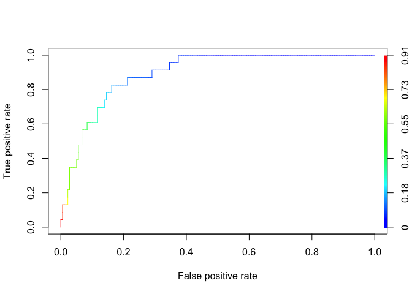

# Predicting Parole Violators
By John Bobo based on a problem set from MIT’s Analytics Edge MOOC  
May 14, 2016  


In many criminal justice systems around the world, inmates deemed not to be a threat to society are released from prison under the parole system prior to completing their sentence. They are still considered to be serving their sentence while on parole, and they can be returned to prison if they violate the terms of their parole.

Parole boards are charged with identifying which inmates are good candidates for release on parole. They seek to release inmates who will not commit additional crimes after release. In this problem, we will build and validate a model that predicts if an inmate will violate the terms of his or her parole. Such a model could be useful to a parole board when deciding to approve or deny an application for parole.

For this prediction task, we will use data from the [United States 2004 National Corrections Reporting Program](http://www.icpsr.umich.edu/icpsrweb/NACJD/series/38/studies/26521?archive=NACJD&sortBy=7), a nationwide census of parole releases that occurred during 2004. We limited our focus to parolees who served no more than 6 months in prison and whose maximum sentence for all charges did not exceed 18 months. The dataset contains all such parolees who either successfully completed their term of parole during 2004 or those who violated the terms of their parole during that year. The dataset contains the following variables:

- **male**: 1 if the parolee is male, 0 if female
- **race**: 1 if the parolee is white, 2 otherwise
- **age**: the parolee's age (in years) when he or she was released from prison
- **state**: a code for the parolee's state. 2 is Kentucky, 3 is Louisiana, 4 is Virginia, and 1 is any other state. The three states were selected due to having a high representation in the dataset.
- **time.served**: the number of months the parolee served in prison (limited by the inclusion criteria to not exceed 6 months).
- **max.sentence**: the maximum sentence length for all charges, in months (limited by the inclusion criteria to not exceed 18 months).
- **multiple.offenses**: 1 if the parolee was incarcerated for multiple offenses, 0 otherwise.
- **crime**: a code for the parolee's main crime leading to incarceration. 2 is larceny, 3 is drug-related crime, 4 is driving-related crime, and 1 is any other crime.
- **violator**: 1 if the parolee violated the parole, and 0 if the parolee completed the parole without violation.

***

#### Problem 1.1 - Loading the Dataset


Load the dataset parole.csv into a data frame called parole, and investigate it using the str() and summary() functions.

```r
parole <- read.csv("/Users/johnbobo/analytics_edge/data/parole.csv")
str(parole)
```

```
## 'data.frame':	675 obs. of  9 variables:
##  $ male             : int  1 0 1 1 1 1 1 0 0 1 ...
##  $ race             : int  1 1 2 1 2 2 1 1 1 2 ...
##  $ age              : num  33.2 39.7 29.5 22.4 21.6 46.7 31 24.6 32.6 29.1 ...
##  $ state            : int  1 1 1 1 1 1 1 1 1 1 ...
##  $ time.served      : num  5.5 5.4 5.6 5.7 5.4 6 6 4.8 4.5 4.7 ...
##  $ max.sentence     : int  18 12 12 18 12 18 18 12 13 12 ...
##  $ multiple.offenses: int  0 0 0 0 0 0 0 0 0 0 ...
##  $ crime            : int  4 3 3 1 1 4 3 1 3 2 ...
##  $ violator         : int  0 0 0 0 0 0 0 0 0 0 ...
```

```r
summary(parole)
```

```
##       male            race           age           state     
##  Min.   :0.000   Min.   :1.00   Min.   :18.4   Min.   :1.00  
##  1st Qu.:1.000   1st Qu.:1.00   1st Qu.:25.4   1st Qu.:2.00  
##  Median :1.000   Median :1.00   Median :33.7   Median :3.00  
##  Mean   :0.807   Mean   :1.42   Mean   :34.5   Mean   :2.89  
##  3rd Qu.:1.000   3rd Qu.:2.00   3rd Qu.:42.5   3rd Qu.:4.00  
##  Max.   :1.000   Max.   :2.00   Max.   :67.0   Max.   :4.00  
##   time.served    max.sentence  multiple.offenses     crime     
##  Min.   :0.00   Min.   : 1.0   Min.   :0.000     Min.   :1.00  
##  1st Qu.:3.25   1st Qu.:12.0   1st Qu.:0.000     1st Qu.:1.00  
##  Median :4.40   Median :12.0   Median :1.000     Median :2.00  
##  Mean   :4.20   Mean   :13.1   Mean   :0.536     Mean   :2.06  
##  3rd Qu.:5.20   3rd Qu.:15.0   3rd Qu.:1.000     3rd Qu.:3.00  
##  Max.   :6.00   Max.   :18.0   Max.   :1.000     Max.   :4.00  
##     violator    
##  Min.   :0.000  
##  1st Qu.:0.000  
##  Median :0.000  
##  Mean   :0.116  
##  3rd Qu.:0.000  
##  Max.   :1.000
```

How many parolees are contained in the dataset?  
**Answer:** 675

***

#### Problem 1.2 - Loading the Dataset


How many of the parolees in the dataset violated the terms of their parole?  

```r
table(parole$violator)
```

```
## 
##   0   1 
## 597  78
```
**Answer:** 78

***

#### Problem 2.1 - Preparing the Dataset


You should be familiar with unordered factors (if not, review the Week 2 homework problem "Reading Test Scores"). Which variables in this dataset are unordered factors with at least three levels?  
**Answer:** `state` and `crime`.

***

#### Problem 2.2 - Preparing the Dataset


In the last subproblem, we identified variables that are unordered factors with at least 3 levels, so we need to convert them to factors for our prediction problem. Using the as.factor() function, convert these variables to factors. Keep in mind that we are not changing the values, just the way R understands them (the values are still numbers).

```r
parole$crime <- as.factor(parole$crime)
parole$state <- as.factor(parole$state)
```

How does the output of summary() change for a factor variable as compared to a numerical variable?

```r
summary(parole)
```

```
##       male            race           age       state    time.served  
##  Min.   :0.000   Min.   :1.00   Min.   :18.4   1:143   Min.   :0.00  
##  1st Qu.:1.000   1st Qu.:1.00   1st Qu.:25.4   2:120   1st Qu.:3.25  
##  Median :1.000   Median :1.00   Median :33.7   3: 82   Median :4.40  
##  Mean   :0.807   Mean   :1.42   Mean   :34.5   4:330   Mean   :4.20  
##  3rd Qu.:1.000   3rd Qu.:2.00   3rd Qu.:42.5           3rd Qu.:5.20  
##  Max.   :1.000   Max.   :2.00   Max.   :67.0           Max.   :6.00  
##   max.sentence  multiple.offenses crime      violator    
##  Min.   : 1.0   Min.   :0.000     1:315   Min.   :0.000  
##  1st Qu.:12.0   1st Qu.:0.000     2:106   1st Qu.:0.000  
##  Median :12.0   Median :1.000     3:153   Median :0.000  
##  Mean   :13.1   Mean   :0.536     4:101   Mean   :0.116  
##  3rd Qu.:15.0   3rd Qu.:1.000             3rd Qu.:0.000  
##  Max.   :18.0   Max.   :1.000             Max.   :1.000
```
**Answer:** The summary for factor variables gives us a frequency count for each level.

***

#### Problem 3.1 - Splitting into a Training and Testing Set


To ensure consistent training/testing set splits, run the following 5 lines of code (do not include the line numbers at the beginning):


```r
set.seed(144)
library(caTools)
split = sample.split(parole$violator, SplitRatio = 0.7)
train = subset(parole, split == TRUE)
test = subset(parole, split == FALSE)
```

Roughly what proportion of parolees have been allocated to the training and testing sets?  
**Answer:** `SplitRatio = 0.7` causes the our training set to have $70\%$ of the data and our test set has the other $30\%$.

***

#### Problem 4.1 - Building a Logistic Regression Model


If you tested other training/testing set splits in the previous section, please re-run the original 5 lines of code to obtain the original split.

Using glm (and remembering the parameter family="binomial"), train a logistic regression model on the training set. Your dependent variable is "violator", and you should use all of the other variables as independent variables.

What variables are significant in this model? Significant variables should have a least one star, or should have a probability less than 0.05 (the column Pr(>|z|) in the summary output). 

```r
log_reg <- glm(violator ~ ., data = train, family = binomial)
summary(log_reg)
```

```
## 
## Call:
## glm(formula = violator ~ ., family = binomial, data = train)
## 
## Deviance Residuals: 
##    Min      1Q  Median      3Q     Max  
## -1.704  -0.424  -0.272  -0.169   2.837  
## 
## Coefficients:
##                    Estimate Std. Error z value Pr(>|z|)    
## (Intercept)       -4.241157   1.293885   -3.28    0.001 ** 
## male               0.386990   0.437961    0.88    0.377    
## race               0.886719   0.395066    2.24    0.025 *  
## age               -0.000176   0.016085   -0.01    0.991    
## state2             0.443301   0.481662    0.92    0.357    
## state3             0.834980   0.556270    1.50    0.133    
## state4            -3.396788   0.611586   -5.55  2.8e-08 ***
## time.served       -0.123887   0.120423   -1.03    0.304    
## max.sentence       0.080295   0.055375    1.45    0.147    
## multiple.offenses  1.611992   0.385305    4.18  2.9e-05 ***
## crime2             0.683714   0.500355    1.37    0.172    
## crime3            -0.278105   0.432836   -0.64    0.521    
## crime4            -0.011763   0.571304   -0.02    0.984    
## ---
## Signif. codes:  0 '***' 0.001 '**' 0.01 '*' 0.05 '.' 0.1 ' ' 1
## 
## (Dispersion parameter for binomial family taken to be 1)
## 
##     Null deviance: 340.04  on 472  degrees of freedom
## Residual deviance: 251.48  on 460  degrees of freedom
## AIC: 277.5
## 
## Number of Fisher Scoring iterations: 6
```
**Answer:** `race`, `state4` (Virginia), and `multiple.offenses`

***

#### Problem 4.2 - Building a Logistic Regression Model


What can we say based on the coefficient of the multiple.offenses variable?

**Answer:** Our model predicts that parolees who commited multiple offenses have $5.01$ times higher odds of being a violator than an otherwise identical parolee.

***

#### Problem 4.3 - Building a Logistic Regression Model


Consider a parolee who is male, of white race, aged 50 years at prison release, from the state of Maryland, served 3 months, had a maximum sentence of 12 months, did not commit multiple offenses, and committed a larceny. Answer the following questions based on the model's predictions for this individual. (HINT: You should use the coefficients of your model, the Logistic Response Function, and the Odds equation to solve this problem.)

According to the model, what are the odds this individual is a violator?

```r
logit <- -4.2411574 + 0.3869904 + 0.8867192 - 0.0001756*50 - 0.1238867*3 + 0.0802954*12 + 0.6837143
odds <- exp(logit)
```

**Answer:** 0.183

According to the model, what is the probability this individual is a violator?

```r
prob <- 1/(1 + exp(-logit))
```

**Answer:** 0.154

***

#### Problem 5.1 - Evaluating the Model on the Testing Set


Use the predict() function to obtain the model's predicted probabilities for parolees in the testing set, remembering to pass type="response".

```r
predTest <- predict(log_reg, newdata=test, type="response")
```

What is the maximum predicted probability of a violation?

```r
max(predTest)
```

```
## [1] 0.907
```
**Answer:** 0.907

***

#### Problem 5.2 - Evaluating the Model on the Testing Set


In the following questions, evaluate the model's predictions on the test set using a threshold of 0.5.

```r
table(test$violator, predTest >= 0.5)
```

```
##    
##     FALSE TRUE
##   0   167   12
##   1    11   12
```

What is the model's sensitivity?  
**Answer:** 0.522

What is the model's specificity?  
**Answer:** 0.933

What is the model's accuracy?  
**Answer:** 0.886

***

#### Problem 5.3 - Evaluating the Model on the Testing Set


What is the accuracy of a simple model that predicts that every parolee is a non-violator?

```r
accuracy <- 1 - mean(test$violator)
```

**Answer:** 0.886 

***

#### Problem 5.4 - Evaluating the Model on the Testing Set


Consider a parole board using the model to predict whether parolees will be violators or not. The job of a parole board is to make sure that a prisoner is ready to be released into free society, and therefore parole boards tend to be particularily concerned about releasing prisoners who will violate their parole. Which of the following most likely describes their preferences and best course of action?  

**Answer:** The board assigns more cost to a false negative than a false positive, and should therefore use a logistic regression cutoff less than 0.5. 

***

#### Problem 5.5 - Evaluating the Model on the Testing Set


What is an accurate assessment of the value of the logistic regression model with a cutoff 0.5 to a parole board, based on the model's accuracy as compared to the simple baseline model? 

**Answer:** The model is likely of value to the board, and using a different logistic regression cutoff is likely to improve the model's value. 

***

#### Problem 5.6 - Evaluating the Model on the Testing Set


Using the ROCR package, what is the AUC value for the model?

```r
library(ROCR)
```

```
## Warning: package 'ROCR' was built under R version 3.1.3
```

```
## Loading required package: gplots
```

```
## Warning: package 'gplots' was built under R version 3.1.3
```

```
## 
## Attaching package: 'gplots'
```

```
## The following object is masked from 'package:stats':
## 
##     lowess
```

```r
rocr_pred <- prediction(predTest, test$violator)
rocr_perf <- performance(rocr_pred, "tpr", "fpr")
plot(rocr_perf, colorize = TRUE)
```



```r
auc <- as.numeric(performance(rocr_pred, "auc")@y.values)
```
**Answer:** 0.895

***

#### Problem 5.7 - Evaluating the Model on the Testing Set


Describe the meaning of AUC in this context.  
**Answer:** The probability the model can correctly differentiate between a randomly selected parole violator and a randomly selected parole non-violator. 

***

#### Problem 6.1 - Identifying Bias in Observational Data


Our goal has been to predict the outcome of a parole decision, and we used a publicly available dataset of parole releases for predictions. In this final problem, we'll evaluate a potential source of bias associated with our analysis. It is always important to evaluate a dataset for possible sources of bias.

The dataset contains all individuals released from parole in 2004, either due to completing their parole term or violating the terms of their parole. However, it does not contain parolees who neither violated their parole nor completed their term in 2004, causing non-violators to be underrepresented. This is called "selection bias" or "selecting on the dependent variable," because only a subset of all relevant parolees were included in our analysis, based on our dependent variable in this analysis (parole violation). How could we improve our dataset to best address selection bias?  

**Answer:**  We should use a dataset tracking a group of parolees from the start of their parole until either they violated parole or they completed their term.
