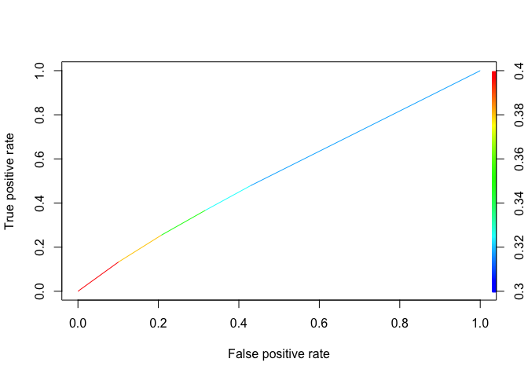
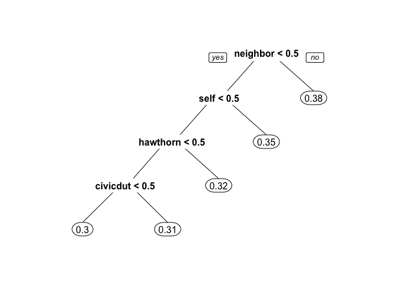
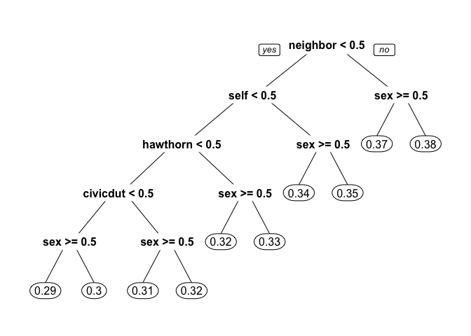
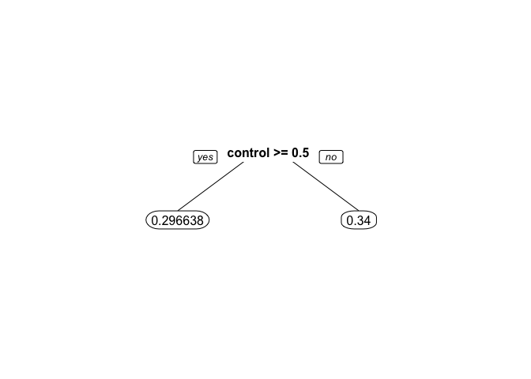
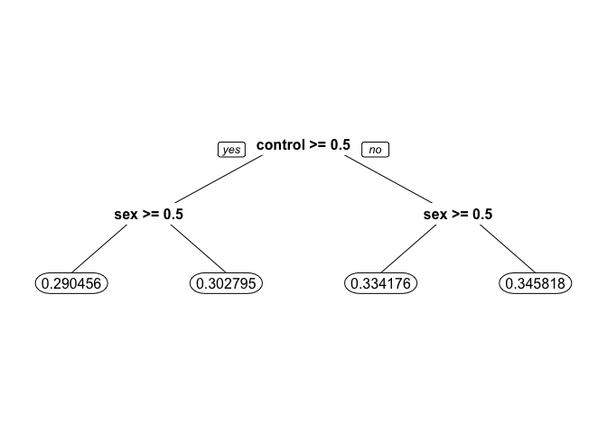
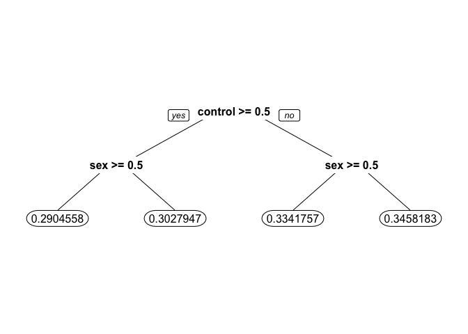

# Understanding Why People Vote
By John Bobo based on a problem set from MIT’s Analytics Edge MOOC  
May 23, 2016  


In August 2006 three researchers (Alan Gerber and Donald Green of Yale University, and Christopher Larimer of the University of Northern Iowa) carried out a large scale field experiment in Michigan, USA to test the hypothesis that one of the reasons people vote is social, or extrinsic, pressure. To quote the first paragraph of their [2008 research paper](http://web.calstatela.edu/faculty/blawson/gerber%20green%20larimer%202008.pdf):

> Among the most striking features of a democratic political system is the participation of millions of voters in elections. Why do large numbers of people vote, despite the fact that ... "the casting of a single vote is of no significance where there is a multitude of electors"? One hypothesis is adherence to social norms. Voting is widely regarded as a citizen duty, and citizens worry that others will think less of them if they fail to participate in elections. Voters' sense of civic duty has long been a leading explanation of vote turnout...

In this homework problem we will use both logistic regression and classification trees to analyze the data they collected.

#### THE DATA

The researchers grouped about 344,000 voters into different groups randomly - about 191,000 voters were a "control" group, and the rest were categorized into one of four "treatment" groups. These five groups correspond to five binary variables in the dataset.

1. "Civic Duty" (variable **civicduty**) group members were sent a letter that simply said "DO YOUR CIVIC DUTY - VOTE!"
2. "Hawthorne Effect" (variable **hawthorne**) group members were sent a letter that had the "Civic Duty" message plus the additional message "YOU ARE BEING STUDIED" and they were informed that their voting behavior would be examined by means of public records.
3. "Self" (variable **self**) group members received the "Civic Duty" message as well as the recent voting record of everyone in that household and a message stating that another message would be sent after the election with updated records.
4. "Neighbors" (variable **neighbors**) group members were given the same message as that for the "Self" group, except the message not only had the household voting records but also that of neighbors - maximizing social pressure.
5. "Control" (variable **control**) group members were not sent anything, and represented the typical voting situation.

Additional variables include **sex** (0 for male, 1 for female), **yob** (year of birth), and the dependent variable **voting** (1 if they voted, 0 otherwise).

***

#### Problem 1.1 - Exploration and Logistic Regression

(1 point possible)

We will first get familiar with the data. Load the CSV file [gerber.csv](https://d37djvu3ytnwxt.cloudfront.net/asset-v1:MITx+15.071x_3+1T2016+type@asset+block/gerber.csv) into R. *What proportion of people in this dataset voted in this election?*


```r
gerber <- read.csv("/Users/johnbobo/analytics_edge/data/gerber.csv")

answer <- mean(gerber$voting)
```
**Answer:** 0.316

***

#### Problem 1.2 - Exploration and Logistic Regression

(1 point possible)
*Which of the four "treatment groups" had the largest percentage of people who actually voted (voting = 1)?*

```r
tapply(gerber$voting, gerber$civicduty, mean)
```

```
##     0     1 
## 0.316 0.315
```

```r
tapply(gerber$voting, gerber$hawthorne, mean)
```

```
##     0     1 
## 0.315 0.322
```

```r
tapply(gerber$voting, gerber$self, mean)
```

```
##     0     1 
## 0.312 0.345
```

```r
tapply(gerber$voting, gerber$neighbors, mean)
```

```
##     0     1 
## 0.308 0.378
```

**Answer:** Neighbors

***

#### Problem 1.3 - Exploration and Logistic Regression

(1 point possible)
Build a logistic regression model for voting using the four treatment group variables as the independent variables (civicduty, hawthorne, self, and neighbors). Use all the data to build the model (DO NOT split the data into a training set and testing set). *Which of the coefficients are significant in the logistic regression model?*

```r
logModel <- glm(voting ~ hawthorne + civicduty + neighbors + self, 
                data = gerber, family = 'binomial')
summary(logModel)
```

```
## 
## Call:
## glm(formula = voting ~ hawthorne + civicduty + neighbors + self, 
##     family = "binomial", data = gerber)
## 
## Deviance Residuals: 
##    Min      1Q  Median      3Q     Max  
## -0.974  -0.869  -0.839   1.459   1.559  
## 
## Coefficients:
##             Estimate Std. Error z value Pr(>|z|)    
## (Intercept) -0.86336    0.00501 -172.46  < 2e-16 ***
## hawthorne    0.12048    0.01204   10.01  < 2e-16 ***
## civicduty    0.08437    0.01210    6.97  3.1e-12 ***
## neighbors    0.36509    0.01168   31.26  < 2e-16 ***
## self         0.22294    0.01187   18.79  < 2e-16 ***
## ---
## Signif. codes:  0 '***' 0.001 '**' 0.01 '*' 0.05 '.' 0.1 ' ' 1
## 
## (Dispersion parameter for binomial family taken to be 1)
## 
##     Null deviance: 429238  on 344083  degrees of freedom
## Residual deviance: 428090  on 344079  degrees of freedom
## AIC: 428100
## 
## Number of Fisher Scoring iterations: 4
```

**Answer:** All four treatment group variables are significant.

***

#### Problem 1.4 - Exploration and Logistic Regression

(2 points possible)
Using a threshold of 0.3, *what is the accuracy of the logistic regression model?* (When making predictions, you don't need to use the newdata argument since we didn't split our data.)


```r
predLog <- predict(logModel, type = 'response')
table(gerber$voting, predLog > 0.3)
```

```
##    
##      FALSE   TRUE
##   0 134513 100875
##   1  56730  51966
```

```r
accuracy <- (134513 + 51966)/nrow(gerber)
```
**Answer:** 0.542

***

#### Problem 1.5 - Exploration and Logistic Regression

(1 point possible)
Using a threshold of 0.5, *what is the accuracy of the logistic regression model?*

```r
table(gerber$voting, predLog > 0.5)
```

```
##    
##      FALSE
##   0 235388
##   1 108696
```

```r
accuracy <- (235388)/nrow(gerber)
```
**Answer:** 0.684

***

#### Problem 1.6 - Exploration and Logistic Regression

(1 point possible)
Compare your previous two answers to the percentage of people who did not vote (the baseline accuracy) and compute the AUC of the model. *What is happening here?*

```r
library(ROCR)
```

```
## Loading required package: gplots
```

```
## 
## Attaching package: 'gplots'
```

```
## The following object is masked from 'package:stats':
## 
##     lowess
```

```r
rocr_pred <- prediction(predLog, gerber$voting)
rocr_perf <- performance(rocr_pred, "tpr", "fpr")
plot(rocr_perf, colorize = TRUE)
```

<!-- -->

```r
auc <- as.numeric(performance(rocr_pred, "auc")@y.values)
```
**Answer:** The auc is 0.531 and accuracy is roughly equal to our baseline.  So even though all the variables are significant, this is a weak predictive model.

***

#### Problem 2.1 - Trees

(1 point possible)
We will now try out trees. Build a CART tree for voting using all data and the same four treatment variables we used before. Don't set the option method="class" - we are actually going to create a regression tree here. We are interested in building a tree to explore the fraction of people who vote, or the probability of voting. We’d like CART to split our groups if they have different probabilities of voting. If we used method=‘class’, CART would only split if one of the groups had a probability of voting above 50% and the other had a probability of voting less than 50% (since the predicted outcomes would be different). However, with regression trees, CART will split even if both groups have probability less than 50%.

*Plot the tree. What happens, and if relevant, why?*

```r
library(rpart)
library(rpart.plot)

cartModel <- rpart(voting ~ hawthorne + civicduty + neighbors + self, data = gerber)
prp(cartModel)
```

<!-- -->

**Answer:** No variables are used (the tree is only a root node) - none of the variables make a big enough effect to be split on

***

#### Problem 2.2 - Trees

(1 point possible)
Now build the tree using the command:


```r
cartModel2 <- rpart(voting ~ civicduty + hawthorne + self + neighbors, 
                    data=gerber, cp=0.0)
```
to force the complete tree to be built. Then plot the tree. *What do you observe about the order of the splits?*

```r
prp(cartModel2)
```

<!-- -->

**Answer:** Neighbor is the first split, civic duty is the last..

***

#### Problem 2.3 - Trees

(1 point possible)
*Using only the CART tree plot, determine what fraction (a number between 0 and 1) of "Civic Duty" people voted:*  

**Answer:** You can find this answer by reading the tree - the people in the civic duty group correspond to the bottom right split, which has value 0.31 in the leaf.

***

#### Problem 2.4 - Trees

(2 points possible)
Make a new tree that includes the "sex" variable, again with cp = 0.0. Notice that sex appears as a split that is of secondary importance to the treatment group.

```r
cartModel3 <- rpart(voting ~ . -yob -control, data = gerber, cp = 0.0)
prp(cartModel3)
```

<!-- -->

*In the control group, which gender is more likely to vote?*  

**Answer:** Men.

*In the "Civic Duty" group, which gender is more likely to vote?*  

**Answer:** Men.

***

#### Problem 3.1 - Interaction Terms

(2 points possible)
We know trees can handle "nonlinear" relationships, e.g. "in the 'Civic Duty' group and female", but as we will see in the next few questions, it is possible to do the same for logistic regression. First, let's explore what trees can tell us some more.

Let's just focus on the "Control" treatment group. Create a regression tree using just the "control" variable, then create another tree with the "control" and "sex" variables, both with cp=0.0.

```r
cartControl <- rpart(voting ~ control, data=gerber, cp=0.0)
prp(cartControl, digits=6)
```

<!-- -->

```r
cartSexControl <- rpart(voting ~ control + sex, data=gerber, cp=0.0)
prp(cartSexControl, digits=6)
```

<!-- -->

*In the "control" only tree, what is the absolute value of the difference in the predicted probability of voting between being in the control group versus being in a different group?*   

**Answer:** 0.043

***

#### Problem 3.2 - Interaction Terms

(1 point possible)
Now, using the second tree (with control and sex), *determine who is affected **more** by NOT being in the control group (being in any of the four treatment groups)*:

**Answer:** They are affected about the same (change in probability within 0.001 of each other).

***

#### Problem 3.3 - Interaction Terms

(1 point possible)
Going back to logistic regression now, create a model using "sex" and "control".

```r
logModelSex <- glm(voting ~ sex + control, data=gerber, family='binomial')
summary(logModelSex)
```

```
## 
## Call:
## glm(formula = voting ~ sex + control, family = "binomial", data = gerber)
## 
## Deviance Residuals: 
##    Min      1Q  Median      3Q     Max  
## -0.922  -0.901  -0.829   1.456   1.572  
## 
## Coefficients:
##             Estimate Std. Error z value Pr(>|z|)    
## (Intercept) -0.63554    0.00651   -97.6   <2e-16 ***
## sex         -0.05579    0.00734    -7.6    3e-14 ***
## control     -0.20014    0.00736   -27.2   <2e-16 ***
## ---
## Signif. codes:  0 '***' 0.001 '**' 0.01 '*' 0.05 '.' 0.1 ' ' 1
## 
## (Dispersion parameter for binomial family taken to be 1)
## 
##     Null deviance: 429238  on 344083  degrees of freedom
## Residual deviance: 428443  on 344081  degrees of freedom
## AIC: 428449
## 
## Number of Fisher Scoring iterations: 4
```

*Interpret the coefficient for "sex":*  
**Answer:** Coefficient is negative, reflecting that women are less likely to vote

***

#### Problem 3.4 - Interaction Terms

(1 point possible)
The regression tree calculated the percentage voting exactly for every one of the four possibilities (Man, Not Control), (Man, Control), (Woman, Not Control), (Woman, Control). Logistic regression has attempted to do the same, although it wasn't able to do as well because it can't consider exactly the joint possibility of being a women and in the control group.

We can quantify this precisely. Create the following dataframe (this contains all of the possible values of sex and control), and evaluate your logistic regression using the predict function (where "LogModelSex" is the name of your logistic regression model that uses both control and sex):

```r
Possibilities = data.frame(sex=c(0,0,1,1),control=c(0,1,0,1))
predict(logModelSex, newdata=Possibilities, type="response")
```

```
##     1     2     3     4 
## 0.346 0.302 0.334 0.291
```

The four values in the results correspond to the four possibilities in the order they are stated above ( (Man, Not Control), (Man, Control), (Woman, Not Control), (Woman, Control) ). *What is the absolute difference between the tree and the logistic regression for the (Woman, Control) case? Give an answer with five numbers after the decimal point.*  

**Answer:** 3.505\times 10^{-4}

***

#### Problem 3.5 - Interaction Terms

(1 point possible)
So the difference is not too big for this dataset, but it is there. We're going to add a new term to our logistic regression now, that is the combination of the "sex" and "control" variables - so if this new variable is 1, that means the person is a woman AND in the control group. We can do that with the following command:

```r
logModel2 = glm(voting ~ sex + control + sex:control, data=gerber, family="binomial")
summary(logModel2)
```

```
## 
## Call:
## glm(formula = voting ~ sex + control + sex:control, family = "binomial", 
##     data = gerber)
## 
## Deviance Residuals: 
##    Min      1Q  Median      3Q     Max  
## -0.921  -0.902  -0.828   1.457   1.573  
## 
## Coefficients:
##             Estimate Std. Error z value Pr(>|z|)    
## (Intercept) -0.63747    0.00760  -83.84  < 2e-16 ***
## sex         -0.05189    0.01080   -4.80  1.6e-06 ***
## control     -0.19655    0.01036  -18.98  < 2e-16 ***
## sex:control -0.00726    0.01473   -0.49     0.62    
## ---
## Signif. codes:  0 '***' 0.001 '**' 0.01 '*' 0.05 '.' 0.1 ' ' 1
## 
## (Dispersion parameter for binomial family taken to be 1)
## 
##     Null deviance: 429238  on 344083  degrees of freedom
## Residual deviance: 428442  on 344080  degrees of freedom
## AIC: 428450
## 
## Number of Fisher Scoring iterations: 4
```
**Answer:** If a person is a woman and in the control group, the chance that she voted goes down.

***

#### Problem 3.6 - Interaction Terms

(1 point possible)
Run the same code as before to calculate the average for each group:

```r
predict(logModel2, newdata=Possibilities, type="response")
```

```
##     1     2     3     4 
## 0.346 0.303 0.334 0.290
```
*Now what is the difference between the logistic regression model and the CART model for the (Woman, Control) case? Again, give your answer with five numbers after the decimal point.*  

```r
prp(cartSexControl, digits=7)
```

<!-- -->

**Answer:** Effectively, there is 0 difference between the two.

***

#### Problem 3.7 - Interaction Terms

(1 point possible)
This example has shown that trees can capture nonlinear relationships that logistic regression can not, but that we can get around this sometimes by using variables that are the combination of two variables. *Should we always include all possible interaction terms of the independent variables when building a logistic regression model?*  

**Answer:** No. It can lead to overfitting and too many variables being used.
